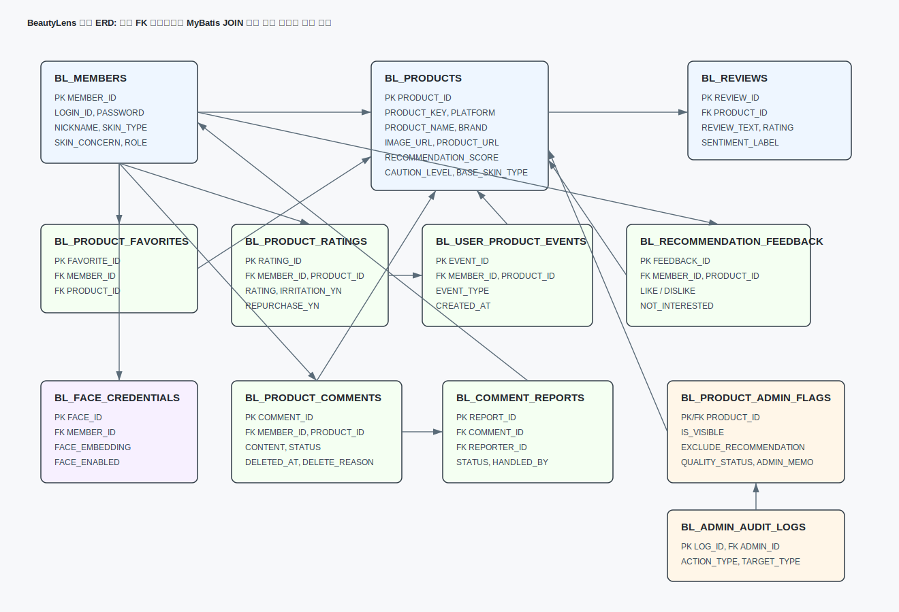
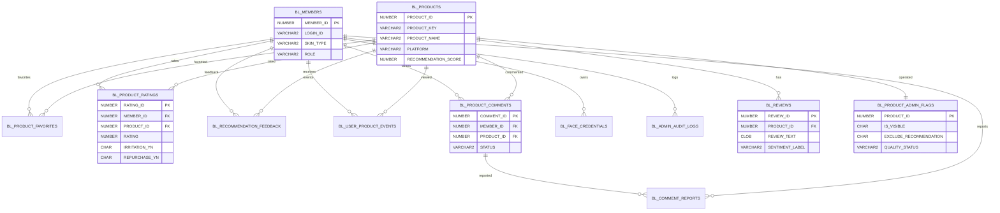

# DB 구조와 ERD

이 문서는 `docs/schema.sql`, `scripts/23_feature_expansion_phase1.sql`, MyBatis Mapper XML, Java Service/Controller를 확인해 작성했습니다. 실제 FK 제약조건이 있는 관계와, Mapper JOIN 및 서비스 로직에서 사용하는 논리 관계를 함께 확인해 정리했습니다.

## DB 설계 개요

BeautyLens DB는 크게 다섯 영역으로 나눴습니다.

| 영역 | 대표 테이블 | 역할 |
|---|---|---|
| 기준 데이터 | `BL_PRODUCTS`, `BL_REVIEWS` | 크롤링/전처리된 상품과 외부 리뷰 |
| 회원 | `BL_MEMBERS`, `BL_FACE_CREDENTIALS` | 로그인, 피부 타입, 얼굴 로그인 정보 |
| 사용자 활동 | `BL_PRODUCT_FAVORITES`, `BL_PRODUCT_RATINGS`, `BL_USER_PRODUCT_EVENTS`, `BL_RECOMMENDATION_FEEDBACK` | 찜, 평가, 최근 본 상품, 추천 피드백 |
| 회원 의견/신고 | `BL_PRODUCT_COMMENTS`, `BL_COMMENT_REPORTS` | 사이트 내부 댓글과 신고 처리 |
| 관리자 운영 | `BL_PRODUCT_ADMIN_FLAGS`, `BL_ADMIN_AUDIT_LOGS` | 상품 운영 상태와 관리자 작업 로그 |

## 테이블 목록과 역할

| 테이블 | 주요 PK | 주요 연결 컬럼 | 역할 |
|---|---|---|---|
| `BL_MEMBERS` | `MEMBER_ID` | `LOGIN_ID`, `ROLE` | 회원 계정, 피부 타입, 관리자 권한 |
| `BL_PRODUCTS` | `PRODUCT_ID` | `PRODUCT_KEY`, `PLATFORM_PRODUCT_ID` | 상품 기준 정보, 추천 점수, 리뷰 집계 |
| `BL_REVIEWS` | `REVIEW_ID` | `PRODUCT_ID` | 크롤링 리뷰 원문, 평점, 감성 라벨 |
| `BL_IMPORT_LOGS` | `LOG_ID` | `FILE_NAME` | import 실행 결과 기록 |
| `BL_FAVORITES` | `FAVORITE_ID` | `MEMBER_ID`, `PRODUCT_ID` | 초기/legacy 찜 테이블 |
| `BL_RECOMMENDATIONS` | `REC_ID` | `MEMBER_ID`, `PRODUCT_ID` | 초기 추천 결과 저장용 테이블 |
| `BL_PRODUCT_FAVORITES` | `FAVORITE_ID` | `MEMBER_ID`, `PRODUCT_ID` | 현재 사이트 찜 기능 |
| `BL_PRODUCT_RATINGS` | `RATING_ID` | `MEMBER_ID`, `PRODUCT_ID` | 별점, 자극 여부, 재구매 의사 |
| `BL_RECOMMENDATION_FEEDBACK` | `FEEDBACK_ID` | `MEMBER_ID`, `PRODUCT_ID` | 추천 좋아요, 별로예요, 숨기기 |
| `BL_USER_PRODUCT_EVENTS` | `EVENT_ID` | `MEMBER_ID`, `PRODUCT_ID` | 최근 본 상품, 상세 조회 등 행동 로그 |
| `BL_PRODUCT_COMMENTS` | `COMMENT_ID` | `MEMBER_ID`, `PRODUCT_ID` | 회원 자유 의견, 수정/삭제 상태 |
| `BL_COMMENT_REPORTS` | `REPORT_ID` | `COMMENT_ID`, `REPORTER_ID` | 댓글 신고와 처리 상태 |
| `BL_FACE_CREDENTIALS` | `FACE_ID` | `MEMBER_ID` | 얼굴 로그인용 인증 정보 |
| `BL_PRODUCT_ADMIN_FLAGS` | `PRODUCT_ID` | `UPDATED_BY` | 상품 숨김, 추천 제외, 품질 상태, 운영 메모 |
| `BL_ADMIN_AUDIT_LOGS` | `LOG_ID` | `ADMIN_ID`, `TARGET_ID` | 관리자 작업 추적 |

## 핵심 ERD 이미지

아래 이미지는 핵심 테이블 중심 ERD입니다. 전체 컬럼을 모두 넣으면 읽기 어려워서 관계 이해에 필요한 주요 컬럼만 넣었습니다.

## Mermaid ERD

## 데이터 적재 흐름

1. 크롤링과 전처리를 거쳐 `preprocessed_v3` 폴더에 상품/리뷰 parquet 파일이 준비됩니다.
2. `scripts/import_products_full.py`가 `product_recommendation_scores.parquet`를 읽고 `BL_PRODUCTS`에 적재합니다.
3. 상품은 `product_key`, `platform`, `product_id`, `product_name`, `brand`, `category`, `avg_rating`, `total_review_count`, 긍정/중립/부정 비율, 피부 타입별 집계, 추천 점수, 주의 신호 등을 가집니다.
4. `scripts/import_reviews_full.py`가 `service_reviews.parquet`를 읽고 `BL_REVIEWS`에 적재합니다.
5. 리뷰는 `product_key`로 `BL_PRODUCTS.PRODUCT_ID`를 찾은 뒤 내부 상품 ID에 연결됩니다.
6. import 결과는 `BL_IMPORT_LOGS`에 기록됩니다.

전체 import 보고서 기준:

| 항목 | 결과 |
|---|---|
| 상품 소스 | `product_recommendation_scores.parquet` |
| 리뷰 소스 | `service_reviews.parquet` |
| 상품 적재 | 1,521건 |
| 리뷰 적재 | 323,574건 |
| 리뷰 상품 매칭 | 323,574건 |
| 고아 리뷰 | 0건 |

## 테이블을 나눈 이유

### 상품과 리뷰 분리

상품은 하나지만 리뷰는 여러 개입니다. 그래서 `BL_PRODUCTS`와 `BL_REVIEWS`를 1:N으로 분리했습니다. 상품 테이블에는 추천에 바로 필요한 집계값을 저장하고, 리뷰 테이블에는 원문과 감성 라벨을 저장했습니다.

### 크롤링 리뷰와 회원 댓글 분리

크롤링 리뷰는 외부 플랫폼에서 가져온 데이터이고, 회원 댓글은 BeautyLens 안에서 사용자가 남기는 의견입니다. 두 데이터는 출처와 목적이 다릅니다. 그래서 외부 리뷰는 `BL_REVIEWS`, 사이트 내부 의견은 `BL_PRODUCT_COMMENTS`로 분리했습니다.

### 사용자 활동 데이터 분리

처음에는 상품과 리뷰만 있으면 된다고 생각할 수 있지만, 추천 서비스처럼 보이려면 사용자가 실제로 어떤 상품을 봤고, 찜했고, 평가했는지가 필요했습니다. 이를 위해 `BL_PRODUCT_FAVORITES`, `BL_PRODUCT_RATINGS`, `BL_USER_PRODUCT_EVENTS`, `BL_RECOMMENDATION_FEEDBACK`를 따로 두었습니다.

### 관리자 운영 상태 분리

관리자가 상품을 숨김 처리할 때 `BL_PRODUCTS` 원본 행을 삭제하면 복구와 검증이 어려워집니다. 그래서 상품 원본은 보존하고, `BL_PRODUCT_ADMIN_FLAGS`에서 `IS_VISIBLE`, `EXCLUDE_RECOMMENDATION`, `QUALITY_STATUS`, `ADMIN_MEMO`를 관리했습니다.

추천 제외도 상품 삭제가 아니라 추천 영역에서만 제외하는 것이 맞다고 판단했습니다. 일반 상품 탐색과 추천 운영의 정책이 다르기 때문입니다.

### 얼굴 인증 정보 분리

얼굴 로그인은 회원 계정과 연결되지만 일반 프로필 정보와 성격이 다릅니다. 그래서 `BL_MEMBERS`에 직접 넣지 않고 `BL_FACE_CREDENTIALS`로 분리했습니다. 얼굴 원본 이미지는 저장하지 않고 인증에 필요한 값만 저장하는 방향으로 구성했습니다.

## 설계하면서 고민한 점

- 한 테이블에 모든 정보를 넣으면 처음에는 단순하지만, 찜/평가/신고/관리자 운영이 늘어날수록 수정과 조회가 어려워집니다.
- 외부 리뷰와 내부 댓글을 섞으면 화면에서 사용자가 어떤 데이터가 외부 리뷰 분석이고 어떤 데이터가 회원 의견인지 구분하기 어렵습니다.
- 관리 기능은 원본 데이터를 삭제하지 않는 구조가 필요했습니다. 그래서 상품 숨김과 추천 제외를 운영 상태로 분리했습니다.
- 추천 점수는 기존 크롤링 기반 점수와 사이트 내부 반응 점수를 구분했습니다. 기존 `RECOMMENDATION_SCORE`는 유지하고, 서비스 화면에서는 내부 반응을 보조 정보로 보여줍니다.

